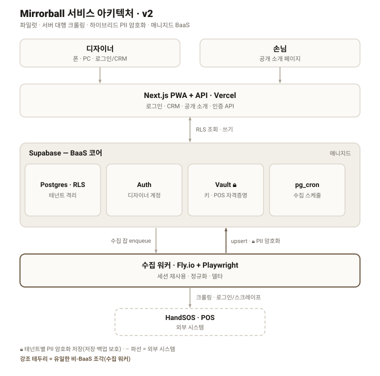

# Mirrorball 서비스 아키텍처 보고서 (v2 · 멀티테넌트)

| 항목 | 내용 |
|---|---|
| 작성일 | 2026-07-11 |
| 상태 | 설계 초안 (파일럿 전제, 이터레이션 중) |
| 전제 | 파일럿 5~20명 · 서버 대행 크롤링(done-for-you) · 하이브리드 PII 암호화 · 매니지드 BaaS |
| 관련 자산 | 다이어그램 `architecture-v2.svg` · 현행 코드 `app/`, `build_app_site.py`, `import_handsos.py`, `app_crypto.py` |

---

## 0. 요약 (Executive Summary)

현행(v1)은 한 사람의 Mac에서 launchd가 HandSOS를 크롤링하고 로컬 파일에 누적한 뒤 암호화해 Netlify 정적 사이트로 10분마다 재배포하는 **단일 테넌트** 구조다. 여러 디자이너에게 제공하는 서비스로 확장하려면 런타임·저장·수집·보안·온보딩·효율의 가정이 모두 깨진다.

본 보고서는 **매니지드 BaaS 기반 멀티테넌트 아키텍처(v2)**를 제안한다. 핵심은 데이터를 정적 파일이 아닌 **관리형 Postgres(테넌트 격리)**에 두고, 디자이너는 인증된 앱으로 실시간 조회하며, HandSOS 수집만 별도 워커가 서버에서 대행하는 것이다. 이 전환으로 v1의 대표적 비효율인 "10분마다 전체 재암호화·재배포"가 **구조적으로 사라진다**. 고객 PII는 테넌트별 키로 저장 시 암호화(하이브리드)하여 유출·백업 위험을 낮추면서 서버 기능성은 유지한다.

가장 큰 리스크는 기술이 아니라 **HandSOS 자격증명 위탁·ToS**이며, 공식 연동 존재 여부 확인을 최우선 액션으로 둔다.

---

## 1. 배경 및 문제 정의

v1은 검증엔 훌륭했으나 멀티테넌트 가정에서 다음이 무너진다.

| v1 방식 | 멀티테넌트에서의 문제 |
|---|---|
| 한 사람 Mac + launchd | 남의 노트북이 서버일 수 없음. 잠자면 멈추고 권한(FDA)·PATH를 손으로 고쳐야 함 |
| 디자이너별 `records.yaml` 파일 | 테넌트 격리·동시성·백업·조회 불가 |
| 10분마다 전체 재암호화·재배포 | 랜덤 IV라 신규 0건이어도 매번 다른 암호문 → 무의미한 배포 ~66회/일 |
| 정적 PWA + 디자이너별 공유 비번 | 실제 계정·인증·권한 부재 |
| 수작업 온보딩(clients·secrets·launchd·Netlify) | 디자이너 추가마다 사람이 붙어야 함 |

> 핵심 통찰: "10분마다 재배포" 비효율은 **정적파일 모델의 부산물**이다. 데이터를 DB에 두고 앱이 실시간으로 읽으면 문제 자체가 소멸한다.

---

## 2. 설계 전제 (합의된 4가지 결정)

1. **규모·시점** — 파일럿 5~20명 먼저, 최소 인프라로 검증 후 확장.
2. **수집 방식** — 서버가 디자이너 POS 자격증명을 위탁받아 HandSOS를 대행 크롤링(done-for-you).
3. **보안 모델** — 하이브리드: 민감 PII는 테넌트별 키로 암호화 저장, 비민감 운영 메타는 평문.
4. **인프라** — 매니지드 BaaS(운영 최소화).

---

## 3. 아키텍처 개요

3개 조각으로 구성된다.

1. **앱/충족층 (Vercel · Next.js)** — 디자이너 PWA + 공개 소개 + 인증 API.
2. **BaaS 코어 (Supabase)** — Postgres(RLS 격리) · Auth · Vault(키·자격증명) · pg_cron(스케줄).
3. **수집 워커 (Fly.io · Playwright)** — 유일한 비-BaaS 조각. HandSOS 로그인 크롤링에 헤드리스 브라우저 상시 런타임이 필요.

---

## 4. 구성요소별 역할과 선택 이유

### 4.1 Next.js + Vercel — 앱 · API · 공개 소개
- **역할**: 디자이너 로그인 후 CRM(홈·알림·고객 카르테·노출·소개편집)을 서빙하고, 인증 API가 Supabase를 테넌트 스코프로 읽고 쓴다. 손님용 공개 소개는 같은 앱이 SSR/ISR로 렌더.
- **선택 이유**: PWA·SSR·API를 한 코드베이스에 담을 수 있고, v1 정적 앱 화면을 컴포넌트로 거의 그대로 포팅 가능. 배포·프리뷰가 관리형이라 운영 부담이 낮고, 데이터가 DB에 있어 재배포 개념이 사라진다.

### 4.2 Supabase — BaaS 코어
- **역할**: Postgres가 전 테넌트 데이터를 담고 **RLS로 행 단위 격리**(자기 살롱만). Auth가 디자이너 계정(v1 공유 비번 대체). Vault가 마스터 키(KEK)와 POS 자격증명을 보관. pg_cron이 테넌트별 수집 잡을 큐에 넣는다.
- **선택 이유**: 파일럿 규모에서 DB·인증·시크릿·스케줄을 각각 붙일 필요 없이 하나로 끝나고, 멀티테넌트 격리를 앱 코드가 아니라 **DB가 강제**해 실수 위험이 낮다. 관리형이라 서버 운영이 거의 없다.

### 4.3 수집 워커 — Fly.io + Playwright
- **역할**: 큐를 소비해 Vault의 자격증명으로 HandSOS에 로그인(세션 재사용)하고, 거래·예약을 스크레이프·정규화해 **PII를 암호화**하여 Supabase에 upsert. 변경이 있을 때만 후속 처리(델타).
- **선택 이유**: HandSOS는 공개 API가 없어 로그인 크롤링이 필요 → 헤드리스 브라우저 상시 런타임이 필요한데 서버리스/Edge는 타임아웃·콜드스타트로 부적합. 그래서 유일하게 BaaS 밖 소형 컨테이너로 분리. v1의 `scrape_handsos`·`import_handsos`·`handsos_reserve` 로직을 그대로 이식한다.

### 4.4 하이브리드 암호화 — Vault 키 계층 + PII 봉투
- **역할**: 마스터 KEK → 테넌트별 DEK로 이름·생일·연락처 등 PII 필드만 AES-GCM 봉투 암호화(v1 `app_crypto` 개념 재사용), 방문수·주기·매출 등 운영지표는 평문으로 조회·집계.
- **선택 이유**: 서버가 대행 크롤링하니 무지식은 불가 → 대신 저장·백업 유출과 옆 테넌트 노출로부터 PII를 막으면서, 서버가 데이터를 읽어야 하는 기능(집계·서버발송 알림)은 살린다. 테넌트별 키라 유출 반경이 하나로 제한된다.

### 4.5 HandSOS — 외부 POS (진실의 원천)
- **역할**: 거래·예약 원본 데이터의 출처. 우리 시스템 밖.
- **제약**: 우리가 고른 게 아니라 디자이너가 이미 쓰는 시스템. 자격증명 위탁·ToS·2FA가 최대 리스크 → 공식 연동 존재 여부 확인이 선행 과제.

---

## 5. 데이터 모델 (Postgres + RLS)

모든 업무 테이블에 `tenant_id` + RLS. PII는 애플리케이션 계층 봉투 암호화, 운영 메타는 평문.

| 테이블 | 핵심 컬럼 | PII | 비고 |
|---|---|---|---|
| `tenants` | id, slug, salon_name, timezone, plan | 아니오 | 디자이너=테넌트(파일럿 1인 1테넌트) |
| `memberships` | tenant_id, user_id(auth), role | 아니오 | 향후 살롱 다인 대비 |
| `pos_credentials` | tenant_id, provider, **enc_blob**, session_cookie(enc), status | 예(암호화) | HandSOS 로그인. Vault/KEK 래핑 |
| `customers` | tenant_id, id, **pii_enc**(이름·생일·전화), visit_count, first/last_visit, total_won, revisit_cycle_days, revisit_state, tier, prefer_tags[] | 혼합 | 식별정보=암호화, 운영지표=평문 |
| `transactions` | tenant_id, customer_id, date, service, amount_won | 부분 | 금액·시술 평문(집계), 고객은 id |
| `bookings` | tenant_id, customer_id, date, time, service, status | 아니오 | 다가오는 예약 |
| `care_items` | tenant_id, customer_id, kind, why, draft, due_at, sent_at | 파생 | 서버 계산 또는 읽기 시 파생 |
| `profiles` | tenant_id, tagline, bio, services[], faq[], location, ko/en | 아니오(공개) | 공개 소개 소스(designers/*.yaml 대체) |
| `sync_jobs` | tenant_id, kind, status, started/finished, stats, error | 아니오 | 관측·재시도(_raw 로그 대체) |

v1 `build_app`의 파생 로직(재방문 주기·`revisit_state`·신호·care 초안)은 서버 함수/워커로 이전해 정렬·조회에 유리하게 물린다.

---

## 6. 보안 모델 — 하이브리드가 실제로 보호하는 것

정직하게: 서버가 대행 크롤링하므로 수집·서빙 순간엔 서버가 PII 평문을 **본다**. 하이브리드는 "무지식"이 아니라 **앱 관리형 키를 쓰는 저장 시 암호화**다.

- **키 계층**: KEK(Vault) → 테넌트별 DEK(래핑되어 DB 저장). PII 필드는 AES-256-GCM 봉투(v1 `app_crypto.py` 재사용).
- **막는 것**: DB 덤프·백업 유출, 잘못된 RLS로 옆 테넌트 조회, 스토리지 유출 시 PII 평문 노출 차단. 테넌트별 DEK로 유출 반경 제한.
- **못 막는 것**: 앱 서버 침해로 KEK까지 탈취되는 경우 → KEK는 Vault/KMS 분리·최소권한·감사로그로 대응.
- **POS 자격증명**: 절대 평문 금지. `enc_blob`으로 암호화, 세션쿠키 암호화 저장으로 매 사이클 재로그인 회피.

---

## 7. 수집 파이프라인 (서버 대행)

1. **스케줄**: pg_cron이 영업시간대 테넌트별 sync 잡을 enqueue(결제 주기적, 예약 시간당). 블랭킷 10분 대신 테넌트별 cadence.
2. **워커**: 큐 소비 → 자격증명 복호화(KEK) → 저장된 세션쿠키로 접속(만료 시에만 재로그인) → Playwright 스크레이프 → 정규화.
3. **업서트**: `customers`/`transactions`/`bookings`에 upsert, PII는 DEK로 암호화 후 저장.
4. **델타·알림**: 실제 변경 시에만 care 재계산·(옵션)알림. **변경 없으면 무동작** → v1 재배포 낭비 소멸.
5. **회복력**: 로그인 실패/2FA/캡차 → 백오프 + `status='needs_reauth'` 표시 후 대시보드 노출. 동시성·간격 제한으로 ToS·레이트리밋 존중.

---

## 8. 앱 · 전달

- **인증**: Supabase Auth(이메일 OTP/비번). v1 공유 비번 잠금을 실제 계정으로 대체 — 이번에 다듬은 진입 화면을 **로그인 화면으로 재사용**.
- **데이터**: 앱이 인증 API로 DB를 실시간 조회(RLS 스코프). 정적 번들·클라이언트 복호화·`?d=slug`·재배포 없음.
- **UI 재사용**: v1 `app/index.html`의 CRM 화면을 Next.js 컴포넌트로 포팅(카톡 문구 복사 포함).
- **공개 소개**: `profiles` → `/{slug}` SSR/ISR. 인앱 편집 저장 시 ISR 재검증으로 즉시 반영 → "소개편집 3단계"가 서버 백엔드로 완성.

---

## 9. 온보딩 · 프로비저닝 (셀프 서비스)

1. 가입 → `tenants`+`memberships`+테넌트 DEK 자동 생성.
2. HandSOS 자격증명 입력(암호화 저장) + 위탁 동의.
3. 최초 백필 잡 enqueue(v1 `--days 365` 이식) → 대시보드 채움.
4. 소개 기본값 생성 → 편집·발행.

수작업(clients 디렉터리·secrets 파일·launchd SLUG·Netlify 사이트) 전부 제거.

---

## 10. 마이그레이션 경로 (v1 → v2)

| 단계 | 내용 | 결과 |
|---|---|---|
| P0 | Supabase 프로젝트·스키마·RLS·KEK/DEK·Vault 셋업 | 빈 멀티테넌트 골격 |
| P1 | Next.js 앱 셸(로그인 + CRM 화면 포팅) + 인증 API | 로그인해 보는 CRM |
| P2 | 수집 워커(Fly.io) — HandSOS 로그인·스크레이프·정규화 이식 + 세션 재사용 | 서버 대행 수집 |
| P3 | hayewoni `records.yaml` → Postgres 1회 임포트(PII 암호화) | hayewoni = 테넌트 #1 |
| P4 | 컷오버: Mac launchd·Netlify 정적 번들 은퇴 | v1 파이프라인 종료 |
| P5 | 셀프 온보딩으로 파일럿 2~3명 추가 | 멀티테넌트 검증 |

P3까지 v1과 병행 운영해 리스크를 낮춘다.

---

## 11. 비용 (파일럿 기준, 대략)

| 항목 | 플랜 | 월 비용 |
|---|---|---|
| Supabase | 무료~Pro | $0~25 |
| Vercel | Hobby~Pro | $0~20 |
| Fly.io 워커(소형 1대) | — | ~$5 |
| **합계** | | **~$0~50/월** (디자이너 20명까지 여유) |

---

## 12. 리스크 · 오픈 이슈

1. **HandSOS 크롤링 ToS·자격증명 위탁** — 최대 법적/운영 리스크. 완화: 명시적 동의·약관, 자격증명 Vault 격리, 공식 연동 병행 추진, 세션 재사용, 재인증 UX. → **확인(2026-07-11): 핸드SOS 개인용 공개 API 없음**(내부 SYNC.md + 공식사이트 교차확인). 스크래핑 불가피 → 워커 설계 유지. 단 **예약은 네이버 예약 연동으로 대체 가능**(고객·매출은 크롤링 필요). 공식 내보내기/제휴는 비개발 트랙 병행.
2. **헤드리스 워커가 유일한 비-BaaS 조각** — 상시 런타임·유지보수. 확장 시 큐·동시성 설계 필요.
3. **하이브리드 키 관리** — KEK 커스터디·로테이션·감사(Vault/KMS 분리, 최소권한).
4. **HandSOS 2FA/캡차** — 자동 로그인 차단 가능성 → 재인증 플로우 필수.
5. **PIPA(개인정보보호법)** — 위탁·보관·파기·동의. 파일럿 단계 최소 준수선 정리.

---

## 13. 로드맵 · 다음 액션

- [x] **HandSOS 공식 연동/API 확인 완료(2026-07-11)** → 공개 API 없음. 스크래핑 유지 · 예약은 네이버 대체 검토 · 제휴 병행
- [x] **P0 완료** — `supabase/migrations/0001_init.sql`(9테이블·RLS 9정책, Postgres 파서 검증) + `supabase/README.md`
- [x] **P1 완료** — `web/`(Next.js 14 + Supabase Auth 매직링크 + RLS 스코프 홈, 빌드 검증 통과)
- [ ] **P2 (다음)** — 수집 워커(Fly.io + Playwright): `scrape_handsos`/`import_handsos` 이식, 세션 재사용
- [~] **P3 코드 완료** — 봉투암호화(`web/lib/crypto.ts`)·임포트(`web/scripts/import-hayewoni.mjs`)·홈 이름 복호화·마이그레이션 `0002_pii_text.sql`. 실행(0002 적용·KEK 설정·임포트)은 사용자 액션.
- [ ] `customers` PII vs 운영 컬럼 경계 최종 확정(하이브리드 키 계층 구현 시)

---

## 부록 A. 스택 선택 비교

| 레이어 | 선택 | 대안 | 선택 근거 |
|---|---|---|---|
| DB·인증·시크릿·크론 | Supabase | Firebase, 직접 Postgres+Auth0 | RLS로 테넌트 격리 깔끔, Auth·Vault·pg_cron 내장, 저비용 |
| 앱·API·공개 소개 | Next.js on Vercel | Remix, SvelteKit | PWA·SSR·API 단일화, v1 UI 포팅 용이, 관리형 배포 |
| 수집 워커 | Fly.io 컨테이너 | Railway, Render, Edge Function | Playwright 상시 실행 필요 → 서버리스 부적합 |
| 관측 | `sync_jobs` 테이블 + 플랫폼 로그 | 외부 APM | 파일럿 규모엔 내장으로 충분 |

> 본 문서는 초안이며 스택·보안 경계·마이그레이션 순서는 조정 가능하다.
